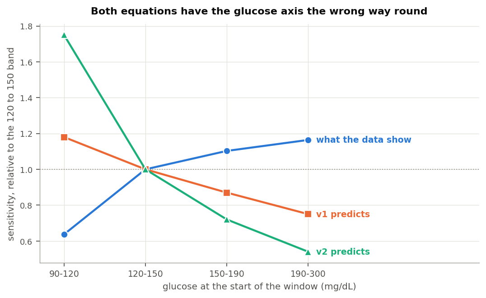
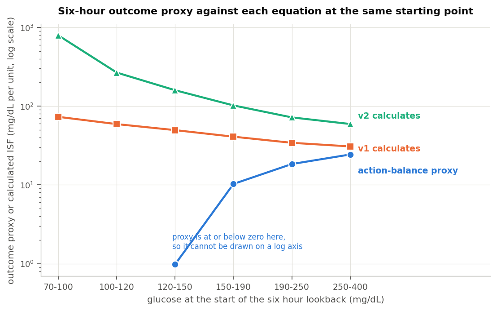
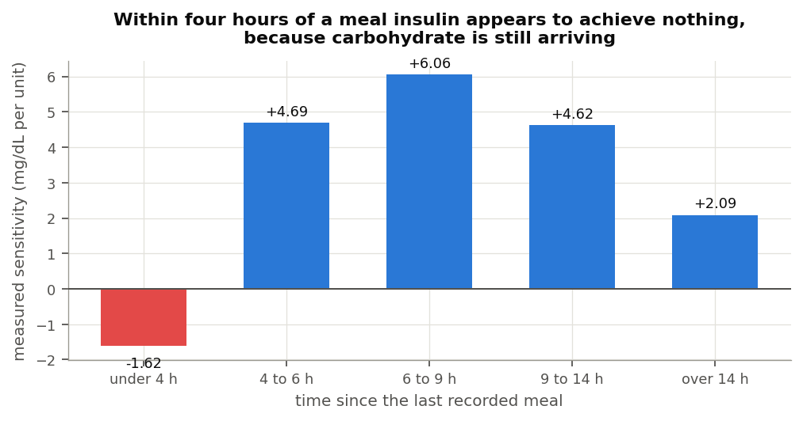
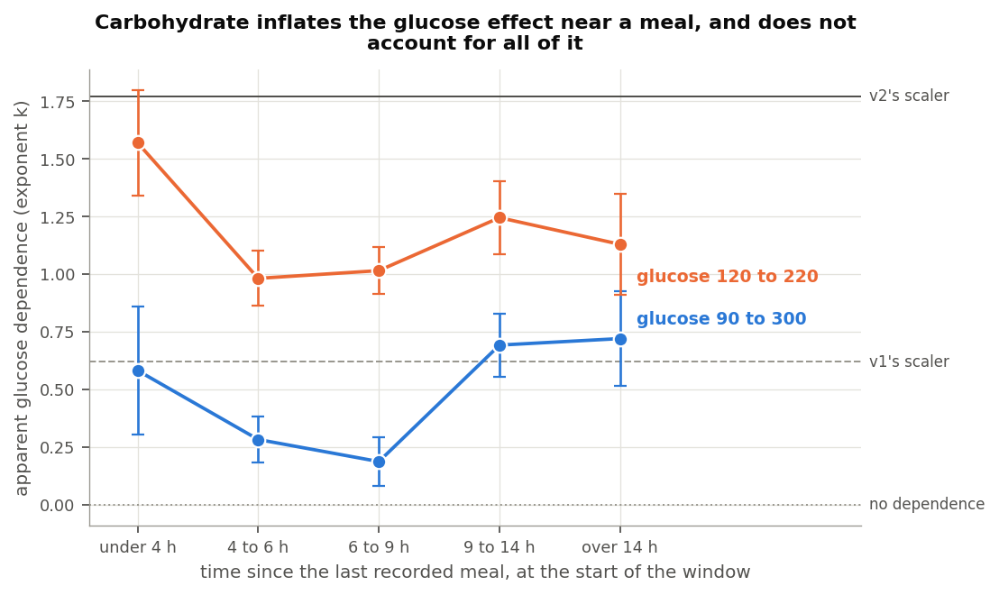

## What was done

Both dynamic ISF equations calculate a sensitivity factor from two inputs: how
much insulin somebody has been using, and where their glucose sits. This work
tested both against seven public study archives, covering about 1,700 people,
ages 2 to 82, with total daily doses from 7 to 107 units. One of those archives,
REPLACE-BG, ran on a pump and a sensor with no algorithm between them, and two
recorded what people ate.

Sensitivity was rebuilt from delivered basal and boluses across overnight
periods, then compared against what each equation calculates at the same moment.
The full paper carries the method and its checks. Three findings are worth
stating on their own.

## One: with carbohydrate excluded, glucose barely moves sensitivity, and moves it the other way

Both equations reduce sensitivity when glucose runs high. The reasoning is
familiar and reasonable: insulin is thought to work less well at higher glucose,
so a correction should be larger.

Measured across overnight periods at least six hours clear of any recorded meal,
sensitivity moves the other way.

| Glucose | Measured | v1 assumes | v2 assumes |
|---|---|---|---|
| 90 to 120 mg/dL | 0.64 | 1.18 | 1.75 |
| 120 to 150 | 1.00 | 1.00 | 1.00 |
| 150 to 190 | 1.10 | 0.87 | 0.72 |
| 190 to 300 | 1.16 | 0.75 | 0.54 |

Those figures scale the 120 to 150 band to 1.00. A unit does about a third less
near target than it does mid-range, then slightly more as glucose climbs. Both
equations have that profile running the other way.

The near-target end explains most of it. That is where the body defends against a
further fall, so a unit achieves less there for reasons that have nothing to do
with high glucose resistance. Above 120 mg/dL the profile is close to flat.

The movement is also small. Out of sample, six candidate glucose shapes including
both equations' own landed within 0.05 mg/dL of each other at predicting the
overnight fall, and a flat sensitivity ranked first. The threshold set before
running the comparison was an improvement of half a milligram per decilitre.
Nothing reached a tenth of that.

Three separate methods return the same reversal, including one that computes a
sensitivity at every glucose reading and fits no curve to anything.

## Two: the original picture may have been shaped by carbohydrate

The effect these equations encode is visible in data. It is just not visible once
meals are excluded.

Within four hours of a meal somebody logged, measured sensitivity comes out at
-1.62 mg/dL per unit.

Nothing has a negative sensitivity. The number says glucose rose while insulin
acted, which is what happens when carbohydrate keeps arriving after the
absorption model has finished counting it. By six to nine hours out, the same
people measure 6.06.

That matters for how the glucose term looks in any dataset that has not excluded
meals. The apparent glucose effect tracks distance from the last meal closely.

| Time since the last recorded meal | Apparent glucose dependence |
|---|---|
| Under 4 hours | +0.610 |
| 4 to 6 hours | +0.308 |
| 6 to 9 hours | +0.207 |

Each band is measured from different periods, and the decline is steady. Close to
a meal the effect is roughly three times its size in clean fasting.

Somebody evaluating dynamic ISF on periods that included the hours after eating
would therefore see much of what these equations encode. They would see
sensitivity apparently falling as glucose rose, because glucose was high and
insulin looked weak for a reason nobody had accounted for. This is offered as a
plausible account of how the original picture formed rather than as a
reconstruction of it. What can be said from these archives is that the effect is
around three times larger where uncounted carbohydrate is present.

## Three: where the equation helps, it may be offsetting a different model's error

There is a reading of this that is more sympathetic to dynamic ISF than the first
two findings suggest, and it deserves stating.

Carbohydrate absorption models in these systems are approximations, and the
measurement above shows one specific way they fall short: they stop counting
before the carbohydrate stops arriving. During that tail, glucose runs high and
more insulin is genuinely needed than the system's own accounting calls for.

A glucose-driven sensitivity term delivers more insulin when glucose is high.
Overnight and away from food, this analysis finds that adjustment pointing the
wrong way. In the hours after a meal, it delivers extra insulin at exactly the
times uncounted carbohydrate is arriving.

So for people whose meals are frequently under-counted, whether through
unannounced eating or through absorption running longer than the model allows,
the two errors work in opposite directions and can offset. The equation would be
compensating for the carbohydrate model rather than describing insulin
sensitivity, and it would still produce a better outcome for that person.

The evidence here supports the mechanism at the population level: the apparent
glucose effect is three times larger near meals than away from them. A
per-person version of the same test, asking whether people with deeper
carbohydrate tails show stronger glucose dependence, did not reach significance
once terms shared between the two measurements were removed. The mechanism is
consistent with what these archives show, and the individual case is not
established by them.

## What this does not say

It does not say the total daily dose half of these equations is wrong. That
relationship is real, survives holding recent carbohydrate constant, and appears
in a model given no functional form to fit. Its exponent measures between about
-0.65 and -0.84, against the -1 that v1 assumes and the -2 that v2 assumes.

It does not cover the hours after a meal as a dosing problem. Those hours appear
here only well enough to show sensitivity turning negative. Working out what a
meal really does across them would put the carbohydrate absorption model itself
under examination, which is different work.

It does not measure sensitivity that moves with the day rather than with the
dose. Exercise, illness and a change in diet all move it over hours and days, and
none of that is measured here.

It gives no number to set. The method shrinks the sensitivities it measures, so
only the shape of the relationship comes through.

## Where that leaves things

The total daily dose term in v1 holds up well and matches what people already run
their pumps at. The squared version in v2 finds no support in these archives, and
its errors are largest for children and for anyone on a small daily total.

The glucose term in both points the wrong way once meals are excluded, though it
is small enough to cost little either way, and it may be doing useful work for
some people by standing in for carbohydrate the system has not fully counted.

The people who built these equations were working from the same rule of thumb
most pump settings come from, and that rule survives this analysis in good shape.
The more interesting question these findings raise is not which sensitivity
exponent to use. It is what a meal is still doing four hours after somebody
logged it, and whether that is better addressed where it happens.

Full analysis, methods and code: `Dynamic-ISF-6-Public-Datasets-2026-08-25` and
the `dynamic-isf-calculations` repository.

## Data attribution

The source of the data is the Loop Study (sponsored by the Jaeb Center for Health
Research and funded by the Helmsley Charitable Trust), but the analyses, content
and conclusions presented herein are solely the responsibility of the authors and
have not been reviewed or approved by the study sponsor.

The source of the data is the Insulin Only Bionic Pancreas Pivotal Trial, but the
analyses, content and conclusions presented herein are solely the responsibility
of the authors and have not been reviewed or approved by the Bionic Pancreas
Research Group or Beta Bionics.

DCLP3, DCLP5, PEDAP and REPLACE-BG are also public datasets from the Jaeb Center
for Health Research, whose releases carry no attribution wording of their own. The
analyses, content and conclusions here are solely mine and have not been reviewed
or approved by any study sponsor.
