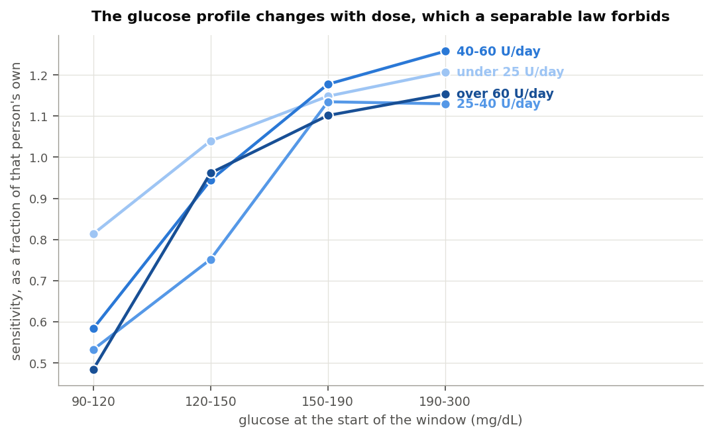

## The question

A pump holds one number that decides how hard it corrects: how far one unit of
insulin moves glucose. Most people arrive at it from the 1800 rule, which divides
1800 by total daily dose, then adjust it when corrections land too hard or too
soft.

Dynamic ISF replaces that fixed number with a calculated one. The algorithm works
out a fresh sensitivity every few minutes from how much insulin the person has
been using and where their glucose sits.

Two versions exist and they disagree about how much the daily dose should count.
The original, v1, keeps the 1800 rule's shape. Double the daily dose and
sensitivity halves. The revised version, v2, squares the dose term. Double the
daily dose and sensitivity falls to a quarter.

Compare somebody on 20 units a day with somebody on 60. v1 makes the second
person's corrections three times smaller per unit. v2 makes them nine times
smaller. The two cross near 64 units a day, so a person's dose decides whether
the newer maths corrects them harder or softer than the older one.

Both versions also cut sensitivity when glucose runs high, on the reasoning that
insulin works less well up there.

I tested all of it against seven public study archives.

## What the archives show

Daily dose changes sensitivity, close to the way v1 says. Sensitivity falls as
dose rises, at an exponent near the one the 1800 rule assumes and a little
shallower. Four methods agree, and one of them could have found nothing.

Glucose changes sensitivity too, in the direction opposite to both equations.
They make insulin work best near target and worst when glucose is high. It works
worst near target, where the body defends against a further fall, and slightly
better when glucose is high.

The two axes do not multiply the way both equations multiply them. Each treats
the glucose term as the same whatever the dose. It is not.

Food explains a real share of what the glucose term picks up. For four hours
after a logged meal, measured sensitivity turns negative: glucose climbs while
insulin acts, because carbohydrate keeps arriving after the absorption model
stops counting it.

Asked to predict the overnight fall, a static 1800 rule beat both equations. v2
missed by four times as much as anything else on the list.

## What that means for somebody running one

Running v1, the dose half holds up. The glucose half points the wrong way but
stays small enough to cost little.

Running v2, nothing here supports the squared dose term. It never beat the
alternatives for a single person out of 1,626, and it fails hardest at small
doses. Squaring the dose hands a child on ten units a day a sensitivity of
several thousand, which turns a correction into almost nothing.

Running neither, the 1800 rule already in most pumps describes these archives
well, and it out-predicted every dynamic version tested.

The people who built these equations worked from that same rule of thumb, and
the rule survives this analysis in good shape.

## The archives

Seven public study archives, about 1,700 people, ages 2 to 82, daily doses from 7
to 107 units.

| Study | System in use | People | Food logged | Median days | Median dose |
|---|---|---|---|---|---|
| Loop | Do-it-yourself Loop, fixed sensitivity | 842 | yes | 397 | 38.6 U |
| REPLACE-BG | Pump and sensor, nothing automating | 196 | yes | 246 | 41.9 U |
| DCLP3 | Control-IQ, adults and adolescents | 112 | no | 183 | 50.0 U |
| DCLP5 | Control-IQ, ages 6 to 13 | 100 | no | 203 | 37.4 U |
| PEDAP | Control-IQ, ages 2 to 5 | 98 | no | 273 | 13.6 U |
| IOBP2 | Bionic pancreas | 336 | no | 93 | 49.0 U |

Two rows carry more weight than the rest.

REPLACE-BG ran in 2015 on a pump and a sensor with no algorithm between them. No
machine chose anyone's insulin by watching their glucose, and that turns out to
matter more than its size suggests.

Loop and REPLACE-BG also recorded meals. Only in those two can I exclude a meal
rather than guess at one.

Screening leaves 708,106 usable overnight stretches from 1,659 people, each
contributing at least forty.

## Measuring what a unit did

No archive records insulin on board, what the algorithm predicted, or usually
even a sensitivity setting. All of it comes back from the basal and boluses that
were delivered.

The method is the obvious one. Take a stretch of time overnight. Measure how far
glucose fell. Add up the insulin acting across that stretch from every dose that
contributed, using a six hour curve. Divide.

Two things decide whether that division means anything.

### Insulin an algorithm chose measures the algorithm

An algorithm delivers more insulin exactly when glucose refuses to come down.
Compare the fall against all the insulin that acted and more insulin goes with
less falling, so the answer turns negative. That would say insulin raises
glucose. It does not. The calculation has measured the controller's policy.

I split insulin by when it was decided. Insulin already present when a stretch
opens was committed before anything in that stretch happened, so it cannot
answer glucose the stretch has yet to record.


The share of people whose sensitivity comes out positive drops from 78% to 8% as
the controller grows more reactive, then climbs back once I use committed insulin
only. REPLACE-BG stands apart, because nothing chose its insulin.

That is why 196 people from a decade ago outweigh their number here.

### Basal is not free

Across any stretch, glucose changes by insulin action minus the glucose the liver
puts out. Basal cancels that output. So a correct basal rate holds glucose flat,
and fall divided by insulin returns zero. Zero basal error, not zero sensitivity.

Run that naive division and it returns 3 to 9 mg/dL per unit against entered
settings of 25 to 60. Everything below therefore measures each stretch against
what that person's glucose usually does at that hour, and against how much
insulin usually acts by then. What is left is the effect of the insulin that was
not routine, which is what a correction is.

### Checking the arithmetic against something recorded

Loop wrote down its own insulin on board at every bolus. Nowhere else in these
archives did an app record its internal state, so I can rebuild that number from
the pump data and compare.

Across 158 people the rebuild tracks Loop's own figure at a correlation of 0.927,
typically within a third of a unit. Something outside my own assumptions confirms
the dose arithmetic.

Reaching it needed the basal profile, which no settings file in the archive
holds, because Loop counts insulin on board net of scheduled basal. Every temp
basal record turns out to carry the rate it overrode.

## Does daily dose change sensitivity?

Yes, by close to the amount the 1800 rule assumes.

### What people had entered

Of the 596 people with a sensitivity factor on record, 581 also have enough pump
data for a daily dose.


The slope against dose is -0.979, with a 95% interval from -1.030 to -0.934. An
exponent of -1 is the 1800 rule, so that interval sits on it.

Multiplying each person's sensitivity by their daily dose gives a median of 2067.
v1 works out to 2139. If the rule holds, that product should not drift with dose.
It does not: the two correlate at +0.024. The same test on v2's squared version
returns +0.859, which is a rule failing across the whole range.

One caveat belongs here rather than in a footnote. An entered setting records a
decision, not a measurement, and most people reach it through the 1800 rule.
Finding that people sit on 1800 over dose partly measures how far that rule
reaches into practice.

The circle does not close the other way. Nothing in practice pushes anyone
towards a squared law, and nothing people run looks like one.

Carb ratios follow more loosely. Multiplying each carb ratio by daily dose gives
a median of 411, so the 500 rule describes practice less tightly.

### What glucose actually did

Measuring from the glucose response gives a shallower relationship. Between
people it comes to -0.83. Within one person, which is what these equations do
several times an hour, it comes to -0.645 across 1,313 people, standard error
0.033, with roughly three quarters sharing the direction.


An exponent of -1 halves sensitivity when dose doubles. An exponent of -2
quarters it. An exponent of -0.65 multiplies it by about 0.64.

Both estimates land between the square root and v1. Neither approaches v2.

### The same question at every reading

Those estimates fit a line through each person's data. The direct alternative
computes a sensitivity at every glucose reading and sets it beside what each
equation calculates at that moment.

At each reading I look back six hours, total the insulin that acted from every
contributing dose, and compare the glucose change against what that person's
glucose usually does over the same six hours at that hour. Only stretches with no
recorded food qualify. That yields 1,408,861 readings from 1,004 people.

The level comes out too low to read. Dividing one noisy number by another drags
the middle of the distribution towards zero. The exponent survives, and I can
check it by running the same calculation on the numbers v1 and v2 themselves
produce, where the answer is known.

| Series | Exponent recovered | Correct answer |
|---|---|---|
| Measured sensitivity | -0.843 (95% CI -0.970 to -0.720) | unknown, that is the question |
| v1's own output | -1.026 | -1 |
| v2's own output | -2.085 | -2 |

The method recovers a known answer to about 0.03. On real data it returns -0.843,
landing on the -0.83 that a different method produced above.

The same readings show how far the equations sit from the measurement. v1 runs
about two and a half times high and lands within 30% of the measured value 16% of
the time. v2 runs five and a half times high and lands within 30% 9% of the time.

### A fourth method that assumes no shape

The three estimates above all fit a shape and read off its parameter, so each
answer depends on the shape chosen. A gradient boosted model chooses none. Given
687,067 stretches from 1,660 people it could find sensitivity falling with dose,
rising with it, moving in steps, or ignoring dose entirely.

What matters is how insulin action and daily dose interact, not what dose does on
its own. Dose shifts the overnight fall for reasons unconnected to sensitivity,
because people on more insulin differ in other ways. Sensitivity multiplies
insulin, so the interaction is where it lives.

| Daily dose | Shift in sensitivity the model attributes to dose |
|---|---|
| 15 U | +0.28 mg/dL per unit |
| 25 U | +0.06 |
| 34 U | +0.06 |
| 43 U | +0.02 |
| 55 U | 0.00 |
| 77 U | -0.04 |

It falls steadily without being asked to, and flattens above roughly forty units
a day. That is the shape a shallow exponent makes, not a steep one. The
magnitudes are shifts around the model's own baseline and carry the same
shrinkage as everything else here.

## Does glucose level change sensitivity?

Yes, opposite to the direction both equations assume.

A trap sits in this one. Glucose starting high falls further than glucose
starting low whatever insulin does, partly through renal clearance and partly
because high values tend to come down. Near target the body pushes back. Let
glucose explain the size of the fall, then ask whether the fall per unit also
depends on glucose, and the first answer arrives labelled as the second.

Every calculation here separates the two. Only the part saying a unit itself did
more or less carries the claim.


| Glucose | Measured | v1 assumes | v2 assumes |
|---|---|---|---|
| 90 to 120 mg/dL | 0.64 | 1.18 | 1.75 |
| 120 to 150 | 1.00 | 1.00 | 1.00 |
| 150 to 190 | 1.10 | 0.87 | 0.72 |
| 190 to 300 | 1.16 | 0.75 | 0.54 |

Those figures scale the 120 to 150 band to 1.00.

A unit does about a third less near target than mid-range, then slightly more as
glucose climbs. Both equations run the other way.

The per-reading calculation says the same in real units, fitting nothing.


| Glucose | Measured | v1 calculates | v2 calculates |
|---|---|---|---|
| 70 to 100 mg/dL | -0.0 | 72.9 | 791.5 |
| 100 to 120 | -1.5 | 58.7 | 261.5 |
| 120 to 150 | 1.8 | 49.1 | 158.2 |
| 150 to 190 | 11.3 | 40.5 | 100.3 |
| 190 to 250 | 21.1 | 33.8 | 70.4 |
| 250 to 400 | 26.9 | 30.5 | 58.0 |

Three methods return that reversal. The third fits no curve to anything.

In practice both equations correct hardest where insulin works best and ease off
where it works least. The near-target end deserves the attention. That is where
the body defends against a hypo, and both equations read the defence as high
sensitivity and dose into it.

The glucose term stays small enough not to do much either way. Out of sample, six
glucose shapes including both equations' own landed within 0.05 mg/dL of each
other, and the flat shape won. I had set the bar at 0.5 mg/dL before a glucose
term could earn its place. The best of them cleared under a tenth of that.

## Do the two combine as the equations assume?

No.

Both multiply a dose term by a glucose term, which assumes the glucose profile
looks the same at 15 units a day and at 80.



| Daily dose | 90 to 120 | 120 to 150 | 150 to 190 | 190 to 300 |
|---|---|---|---|---|
| Under 25 U | 0.81 | 1.04 | 1.15 | 1.21 |
| 25 to 40 U | 0.53 | 0.75 | 1.14 | 1.13 |
| 40 to 60 U | 0.58 | 0.94 | 1.18 | 1.26 |
| Over 60 U | 0.48 | 0.96 | 1.10 | 1.15 |

Those rows would have to match for either equation to hold. The dip near target
runs mild under 25 units a day and about twice as deep above it. Fitting the
interaction directly returns -0.444, roughly half the size of the dose term.

One thing behaves. Comparing across people, somebody's glucose profile tracks
their daily dose not at all, at a rank correlation of -0.017 over 971 people. The
two axes tangle within a person, not between them.

## Sensitivity, or food?

Both explanations predict the same measurement. Sensitivity really falling when
glucose runs high and when recent dose runs large would mean the equations
describe something real. Carbohydrate still absorbing after the model stops
counting it would raise glucose, make insulin look weak, and enlarge recent dose
because the person ate. The two look identical from the outside.

Loop and REPLACE-BG recorded meals, so time since eating tells them apart.


Within four hours of a logged meal, measured sensitivity reads -1.62 mg/dL per
unit. Nothing has a negative sensitivity. The number says glucose rose while
insulin acted, which is carbohydrate arriving after the absorption model wrote it
off. By six to nine hours out it reaches 6.06.

That is the absorption tail, measured directly.


The apparent glucose effect follows the same curve, running about three times
larger near a meal than in clean fasting. So food drives a real share of what the
glucose term responds to.

It does not drive all of it. Well clear of a meal some glucose dependence
remains.

Dose behaves differently. Holding recent carbohydrate constant keeps 83% of it.

| Group | Before | Holding food constant | Kept |
|---|---|---|---|
| Loop | -0.586 | -0.500 | 85% |
| REPLACE-BG | -1.443 | -0.978 | 68% |
| Together | -0.648 | -0.539 | 83% |

The dose half describes something mostly real. The glucose half is substantially
food.

## Predicting the night

Each candidate gets a per-person offset, fitted on that person's first 70% of
nights and scored on the rest. That favours the equations. Most overnight insulin
is basal, and charging the liver to a sensitivity factor would blame it for work
it never had.


| Candidate | Typical miss |
|---|---|
| Static 1800 rule | 34.1 mg/dL |
| Best single value for that person | 34.4 |
| v1 | 36.7 |
| The person's own entered setting | 37.3 |
| 355 over the square root of dose | 37.9 |
| v2 | 140.9 |

Of 1,626 people the best candidate was a single fitted value for 638, the static
1800 rule for 587, the square root form for 195, v1 for 135, and their own
setting for 71. It was v2 for none.

v2 also overshoots rather than merely scattering: it expects 41 mg/dL more fall
than happens, at the median. Its worst ground is small doses, where its typical
miss reaches 322 mg/dL below twenty units a day. The miss shrinks as dose climbs,
reaching 83 mg/dL above 64 units a day, which is the crossover behaving as the
algebra requires. Even there it misses by more than twice anything else.

## Could the method be producing this?

Building people whose sensitivity follows a chosen rule, then running them through
the same machinery, answers that.


| Built in | Came back |
|---|---|
| -0.50 | -0.50 |
| -1.00 | -1.02 |
| -2.00 | -1.57 |

Shallow relationships return almost exactly. Steep ones flatten slightly. The
bottom row decides it: a squared law returns between -1.56 and -1.85 under every
condition I tried, including one where nearly half of all meals went unrecorded.
The measurements ran between -0.65 and -0.88. A squared law cannot look like that.

## What this does not settle

It supplies no number to set. The method shrinks the sensitivities it measures,
so only the shape of the relationship comes through, not a constant.

It covers overnight fasting. The four hours after a meal appear here only well
enough to show sensitivity turning negative. Working out what a meal really does
across those hours would put the carbohydrate absorption model itself under
examination, which is different work and probably more useful.

It says nothing about sensitivity that moves with the day rather than the dose.
Exercise, illness and a change in diet all move it over hours and days. None of
that appears here, and none of it is being argued against.

The cohorts running automated systems make weak evidence alone. In the Control-IQ
studies the share of people with a positive sensitivity sits near a coin toss,
and below one for the youngest. They back a direction rather than establishing it.

Two faults in the underlying data needed repair. Extended bolus durations arrive
in milliseconds for three of the six studies and in seconds for the other two, so
a one hour square wave reads as a thousand hours. The database also returns
timestamps at microsecond resolution, which divided every basal total by a
thousand until I checked the rebuild against the database's own sums. Anyone
working from these archives will meet both.

## Where the two equations stand

v1's dose term holds up, and holds up best in the ground it came from: it
describes what people run their pumps at to within a few per cent. Against the
glucose response it looks a touch steep, with support running between the square
root and v1.

Its glucose term points the wrong way, as does v2's. Both make insulin most
effective near target where the measurement makes it least effective. The term
stays small enough to cost little.

v2's squared dose term finds no support here. What people run contradicts it, what
glucose does contradicts it, it never beat the alternatives for anyone, and the
simulation says a squared law could not have looked like anything I measured. It
behaves worst in children and at small daily doses, where a correction that comes
out far too small does the most harm.

The scope of that conclusion is narrow. It describes what a large and varied group
of people did. It says nothing about anyone's intent or competence, it covers
overnight fasting in archives collected for other purposes, and the equations
under examination moved the discussion to where this work could begin. Another
route into the same question would be welcome.

Anyone wanting a dose term will find support here for something between about
-0.65 and -1.0, applied to a person's own level rather than used to set it. But a
plain static 1800 rule out-predicted every dynamic version tested, so the question
I am left with is not which exponent to use. It is whether sensitivity is the
right place for this adjustment at all, when the clearest unfinished business is
what a meal keeps doing four hours after somebody logged it.

## Methods

Windows run four hours from starts between 23:00 and 03:00. Each needs 80% sensor
coverage, a starting glucose between 90 and 300 mg/dL, and either six hours clear
of logged carbohydrate or, where nothing is logged, four hours clear of a bolus
large against that person's own daily dose. Screening looks only backwards, never
at what glucose did next. Dropping the nights where glucose rose removes the
nights insulin worked least well and inflates the result.

Insulin action comes from convolving the delivery record with an insulin model.
Loop subjects use the models LoopKit ships, taken from its source rather than
approximated. The rest use the oref exponential at six hours with a 75 minute
peak.

Per-person fits use ordinary least squares with a heteroskedasticity-robust
standard error. Population figures pool the per-person estimates by the method of
DerSimonian and Laird, matching the earlier work in this series so the two read
side by side. Intervals are percentile bootstrap over people, weighted as the
estimate they wrap.

The per-reading calculation looks back six hours at every reading. It takes the
glucose change and the insulin action as departures from that person's own median
for that half hour of the day, and requires the excess insulin action to clear 0.3
units so the denominator is not noise.

Testing whether the axes multiply cleanly means fitting insulin action against
glucose, against dose, and against the product, then reading the third
coefficient. The glucose profile is measured as a power law and, because the power
law describes it poorly, by interacting insulin action with glucose band
indicators, which imposes no shape.

Fitted as a power law the glucose exponent comes to +0.238, standard error 0.044.
The body above does not quote it because it is unstable: a narrower glucose range
moves it to about +1.0, a larger shift than the number itself. A power law cannot
describe a step, so fitting one across the profile in the table averages the step
into almost no slope, whose sign follows whichever range was chosen.

An earlier draft reported a glucose exponent of -2.67. An indexing defect caused
it. The interaction term had been inserted ahead of the insulin coefficient in
the design matrix while the code still read that coefficient from a fixed
position, so the interaction was divided by the starting glucose term. A second
implementation disagreed on the sign, which is how it surfaced. Design matrix
columns now carry names and a regression test covers it.

Code sits in `inv009/` in the `dynamic-isf-calculations` repository, with 29 tests.

```
psql -d oref -f inv009/ingest/sql/05_settings.sql
python3 inv009/ingest/load_settings.py
python3 -m inv009.build_cache
python3 -m inv009.entered_isf && python3 -m inv009.effective_isf
python3 -m inv009.tdd_axis && python3 -m inv009.glucose_axis
python3 -m inv009.head_to_head && python3 -m inv009.synthetic
python3 -m inv009.loop_model_infer && python3 -m inv009.ml_shap
python3 -m inv009.carb_hypothesis && python3 -m inv009.joint_surface
python3 -m inv009.pointwise_isf && python3 -m inv009.figures
```

## Data attribution

The source of the data is the Loop Study (sponsored by the Jaeb Center for Health
Research and funded by the Helmsley Charitable Trust), but the analyses, content
and conclusions presented herein are solely the responsibility of the authors and
have not been reviewed or approved by the study sponsor.

The source of the data is the Insulin Only Bionic Pancreas Pivotal Trial, but the
analyses, content and conclusions presented herein are solely the responsibility
of the authors and have not been reviewed or approved by the Bionic Pancreas
Research Group or Beta Bionics.

DCLP3, DCLP5, PEDAP and REPLACE-BG are also public datasets from the Jaeb Center
for Health Research, whose releases carry no attribution wording of their own. The
analyses, content and conclusions here are solely mine and have not been reviewed
or approved by any study sponsor.

Dates in these archives are shifted or rebased per participant, so time of day is
preserved and calendar date is not. Nothing here depends on calendar date.
