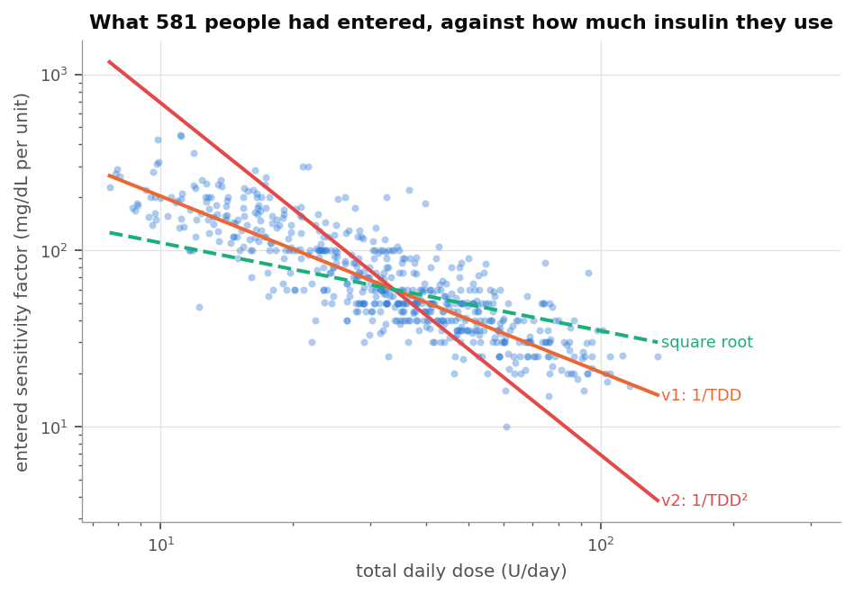
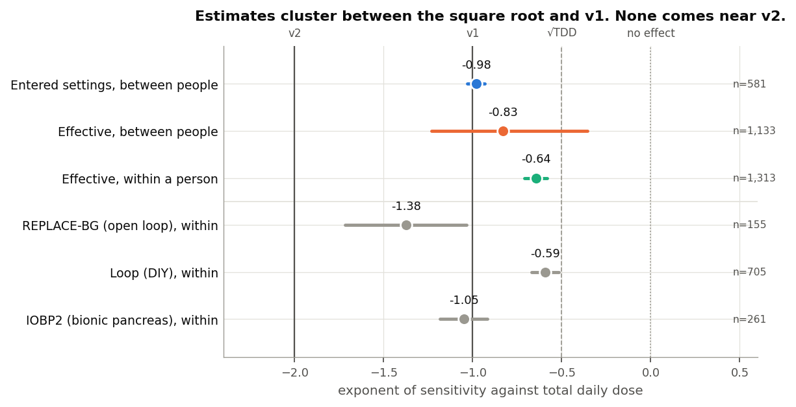
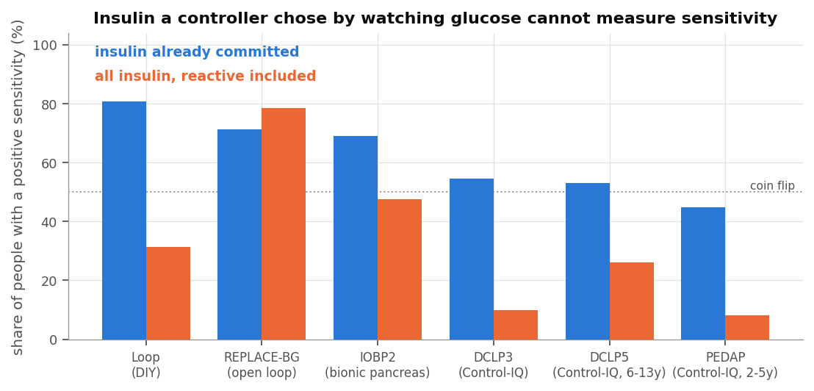
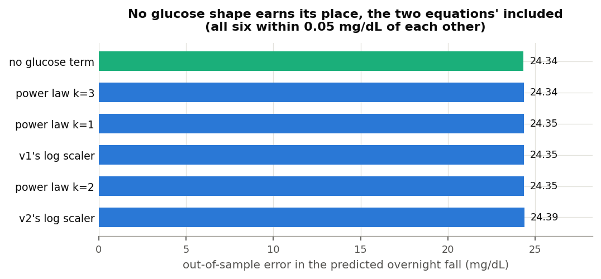
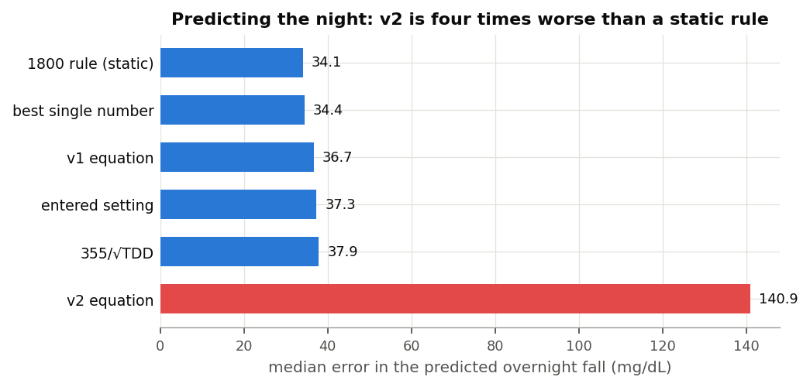
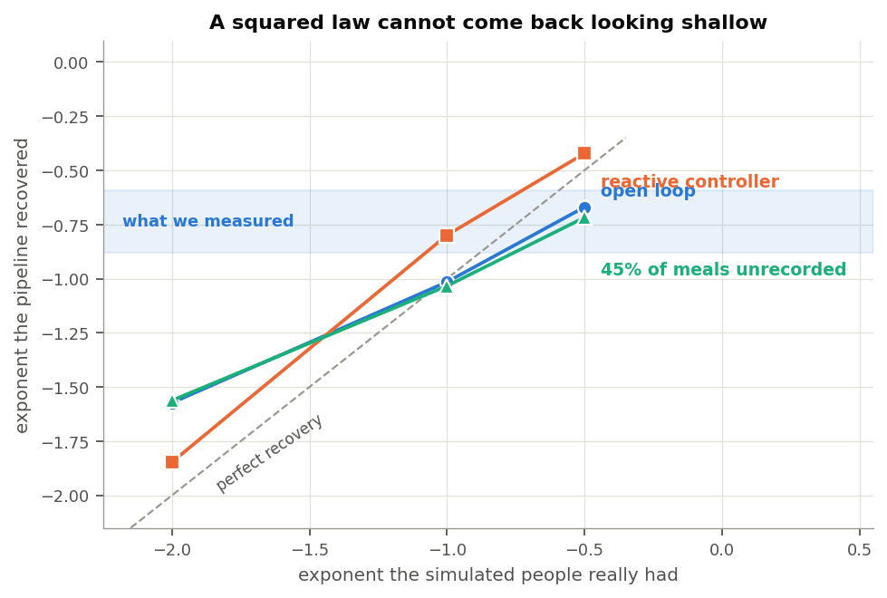

## Summary

Sensitivity does fall as total daily dose rises. The relationship appears in four
independent measurements, one of which was free to find no relationship at all.

The exponent is the point at issue between the two equations. Settings people had
entered scale with daily dose at a slope of -0.979 (95% CI -1.030 to -0.934),
which is the assumption v1 makes. Measured from the overnight glucose response the
relationship is shallower: -0.83 between people (95% CI -1.23 to -0.36) and -0.645
within a person (SE 0.033, n = 1,313). No measurement here approached the
exponent of -2 that v2 assumes.

The glucose-dependent half of both equations did not improve prediction. Six
candidate shapes, including the scalers both equations use, fell within 0.05 mg/dL
of each other out of sample, and the flat shape ranked first. The threshold set
before running was an improvement of 0.5 mg/dL.

Asked to predict the overnight fall, a static 1800 rule gave the lowest error at
34.1 mg/dL. v1 cost 2.6 mg/dL more. v2 gave 140.9 mg/dL with a median bias of +41,
and was not the best candidate for any of the 1,626 people scored.

## Background

Both dynamic ISF equations recalculate a person's sensitivity factor from their
recent total daily dose, several times an hour, in place of the fixed value in
their settings. They disagree about how steeply sensitivity falls as dose rises.
The original, referred to throughout as v1, has sensitivity inversely proportional
to daily dose. The revised form, v2, has it inversely proportional to the square
of daily dose. For two people whose doses differ threefold, v1 implies a
threefold difference in sensitivity and v2 a ninefold one. The two curves cross
near 64 units a day, so which of them gives the stronger correction depends on
which side of that a person sits.

I examined this question previously using data from people running loops, and
concluded that the dose relationship was real but shallower than either equation
assumed. That work left the question open for reasons that were structural. The
cohort was a few hundred people, almost all on doses between 20 and 80 units a
day, which gave little leverage either side of the crossover. Every estimate
depended on the loop's own insulin model, which is the object under examination.
And no open-loop comparison was available.

The public study archives address all of these. The analysis below uses seven of
them, covering approximately 1,700 people, ages 2 to 82, daily doses from 7 to 107
units, and four automated systems alongside one cohort using none.

These equations derive from the same rule of thumb that most pump settings come
from, and were built by people contributing their time to open-source automated
insulin delivery. One finding here is that the rule holds up well against what
people run. The finding I could not support is the squared form.

## The archives

| Study | System in use | People | Carbohydrate logged | Median days | Median dose |
|---|---|---|---|---|---|
| Loop | Do-it-yourself Loop, fixed sensitivity | 842 | yes | 397 | 38.6 U |
| REPLACE-BG | Pump and sensor, no automation | 196 | yes | 246 | 41.9 U |
| DCLP3 | Control-IQ, adults and adolescents | 112 | no | 183 | 50.0 U |
| DCLP5 | Control-IQ, ages 6 to 13 | 100 | no | 203 | 37.4 U |
| PEDAP | Control-IQ, ages 2 to 5 | 98 | no | 273 | 13.6 U |
| IOBP2 | Bionic pancreas | 336 | no | 93 | 49.0 U |

FLAIR is present in the archive but its release ships no pump file, so it
contributes daily totals and nothing further.

Two rows carry disproportionate weight in what follows. REPLACE-BG ran in 2015 on
a pump and a sensor with no algorithm between them, making it the only cohort
where the insulin a person received was not selected by a system observing their
glucose. Loop and REPLACE-BG are also the only cohorts where people recorded what
they ate, so they are the only two where a meal can be screened out rather than
inferred.

The extraction produced 2.2 million candidate overnight windows, of which 708,106
passed screening, from 1,659 people contributing at least forty each.

## Method

None of these archives holds an insulin-on-board figure, a loop prediction, or in
most cases a sensitivity setting. Everything was reconstructed from delivered
basal and boluses.

Each window covers four hours from a start on the hour between 23:00 and 03:00.
The fall in glucose across those four hours was measured against the insulin
acting during them, obtained by convolving the delivery record with an insulin
model. Loop subjects were given the models Loop itself ships, taken from the
LoopKit source rather than approximated; the remaining cohorts were given the oref
exponential. Dividing the fall by the acting insulin, holding starting glucose and
prior glucose constant, yields milligrams per decilitre per unit.

Two aspects of that construction do most of the work.

Insulin was separated by when it was committed. Insulin already present when a
window opened was determined before anything in that window occurred, so it cannot
be a response to the glucose the window subsequently measures. Insulin delivered
during the window can be, and under an automated system usually is. The two enter
every fit as separate terms.

Screening looked only backwards. A window was retained or dropped on its starting
glucose, on sensor coverage, and on time since the person last ate. It was never
screened on the subsequent glucose trajectory. Excluding nights on which glucose
rose, on the reasoning that something must have been eaten, removes
disproportionately the nights on which insulin acted least effectively, which
inflates the estimated sensitivity rather than cleaning it. Those filters exist in
the code as a sensitivity arm and move nothing material.

### Validation of the dose reconstruction

Loop recorded its own insulin-on-board figure at every bolus. That is the only
point in these archives where an application's internal state was written down, so
it can be recomputed from the pump record and compared against what the
application held.

Across 158 people with sufficient records, the reconstruction tracked Loop's own
figure at a median correlation of 0.927, with a median absolute difference of 0.32
units. This validates the dose reconstruction against a recorded quantity rather
than against internal assumptions.

Producing it required something the archives do not obviously contain. Loop counts
insulin on board net of scheduled basal, so a temporary basal contributes only the
difference between what it delivered and what the profile would have delivered.
Reconstructing that requires the basal profile, which appears in no settings file
in the archive. It proved recoverable: every temporary basal record carries the
rate it suppressed. Six and a half gigabytes of raw text reduces to 1.6 million
rate changes, giving basal schedules for 842 people.

The limit of that check should be stated. Every candidate insulin model shows a
small positive level bias, so the fastest-decaying model wins by absorbing it,
which leaves the model each person was running only weakly identified. The
correlation is the finding. The model selection is a weaker claim, and nothing
downstream depends on it.

## Settings people had entered

Of the 596 people with a recorded sensitivity factor, 581 also have thirty or more
complete days of pump record from which to take a daily dose.

Their entered settings scale with daily dose at a log-log slope of -0.979, with a
95% interval from -1.030 to -0.934. Multiplying each person's sensitivity by their
daily dose gives a median of 2067, against the 2139 that v1 evaluates to at a
normal target. Under the 1800 rule that product should not vary with dose, and it
does not: the Spearman correlation between them is +0.024. The equivalent test for
the squared law returns +0.859, which indicates the relationship failing
consistently across the range rather than at one end of it.



This result carries a caveat that should be stated rather than buried, because it
approaches circularity. An entered sensitivity factor records a decision. People
and their clinical teams commonly arrive at it through the 1800 rule, which is the
source of v1's exponent. Finding that entered settings sit
on 1800 over dose is therefore in part a finding about the reach of that rule in
practice.

The circularity does not run in the other direction. Nothing in clinical practice
directs people towards a squared law, and nothing in what people run resembles
one.

Two secondary results are worth recording. Within a single age band the slope is
shallower, between -0.68 and -1.10, so part of the pooled -0.98 reflects combining
young children with adults. Carbohydrate ratios scale at -0.63 with a median
product of 411, making the 500 rule a looser description of practice than the 1800
rule.

## The dose relationship in the glucose response

The harder question is what a unit of insulin achieved, rather than what people
had entered.



Between people, using only insulin committed before each window opened, the slope
is -0.83 with a 95% interval of -1.23 to -0.36. Taking logarithms requires
dropping anyone whose estimate came out negative, and those people are not a
random subset, so the power law was also fitted directly on the natural scale
where all of them survive. That fit returns -0.75.

Within a single person the exponent is -0.645, with a standard error of 0.033,
pooled across 1,313 people, of whom roughly three quarters share the sign. This is
the version that has not previously been tested, and it is the version these
equations implement: they run inside one person, several times an hour, from a
dose figure blended over recent hours and days. A relationship holding across a
population need not hold within an individual.

Both estimates fall between the square root and v1. Neither approaches v2.

### A second estimate that assumes no functional form

The measurements above fit a shape and report its parameter, which makes each
answer conditional on the shape chosen. A gradient boosted model imposes none.
Given 687,067 windows from 1,660 people it was free to find sensitivity falling
with dose, rising with it, moving in steps, or not depending on dose.

The quantity to read from it is the interaction between insulin action and daily
dose. Dose on its own has a substantial effect on the overnight fall that has
nothing to do with sensitivity, because people on more insulin differ in other
ways. Sensitivity is the multiplier on insulin, so the interaction is where it
appears.

| Daily dose | Shift in sensitivity attributable to dose |
|---|---|
| 15 U | +0.28 mg/dL per unit |
| 25 U | +0.06 |
| 34 U | +0.06 |
| 43 U | +0.02 |
| 55 U | 0.00 |
| 77 U | -0.04 |

The profile declines monotonically without having been asked to, and flattens
above roughly forty units a day, which is the shape a shallow exponent produces.
The magnitudes should not be read as sensitivity itself. They are shifts around
the model's own baseline and carry the same attenuation as every other estimate
here.

### Confounding by indication, and why one small cohort matters

There is a reason to distrust all of the above, and it is better demonstrated than
argued.

Under an automated system, insulin approximates a function of recent glucose. More
of it is delivered precisely when glucose is not falling. Regressing the fall on
all the insulin that acted returns a negative slope, which would imply that
insulin raises glucose. What that estimate measures is the algorithm's policy
rather than anyone's physiology.



Across the cohorts, the proportion of people whose sensitivity estimate is
positive falls from 78% to 8% as the system becomes more reactive, and recovers
when only committed insulin is used. REPLACE-BG behaves as the design predicts. It
is the only cohort in which including all the insulin improves the estimate rather
than degrading it, because in 2015 no algorithm was choosing it.

That is why 196 people from a decade ago carry weight out of proportion to their
number, and why they are reported separately throughout. Their within-person
exponent is -1.38, steeper than the pooled figure and the closest any cohort comes
to v1. It does not approach v2 either.

## Dependence on glucose level

Both equations include a term that reduces sensitivity when glucose is high.

Testing that term has a trap in it. High glucose falls further than low glucose
irrespective of insulin, through mass action, renal clearance and regression to
the mean, and near target the body opposes a further fall. A model that allows
glucose to explain the size of the fall, and then asks whether the fall per unit
also depends on glucose, will answer the first question and record it as the
second. Every fit here therefore carries an additive glucose term, and the claim
rests on the interaction between insulin action and glucose, which is the only
quantity implying that sensitivity itself moved.

Two results follow.

Pooled across 1,528 people the exponent is -2.67, and its sign is opposite to what
both equations assume: net sensitivity rises with glucose. Approximately 40% of
people show the direction the equations assume. This agrees with the earlier
finding on looping data, where the reasoning is set out at length. In short, the
effect the equations are reaching for competes against clearance that rises with
glucose and against counter-regulation near target.

The practical result is more useful.



Out of sample, across 1,616 people, six candidate shapes fall within 0.05 mg/dL of
each other and the flat shape ranks first. Both equations' scalers rank in the
lower half. The threshold set before running this analysis was an improvement of
0.5 mg/dL before a glucose term could be said to earn its place. The largest
observed improvement was under a tenth of that.

## Predicting the overnight fall

The exponents address the science. The comparison below addresses the practical
consequence of using either equation.

Each candidate received a per-person intercept fitted on that person's first 70%
of nights and was scored on the remainder. This is generous to the equations. Most
overnight insulin is basal, delivered to offset endogenous glucose production, so
requiring the sensitivity factor to account for that offset would penalise an
equation for a quantity it was never intended to supply.



| Candidate | Median error | Median bias |
|---|---|---|
| Static 1800 rule | 34.1 mg/dL | +2.9 |
| Best single value for that person | 34.4 | -1.4 |
| v1 | 36.7 | +0.9 |
| The person's own entered setting | 37.3 | -0.2 |
| 355 over the square root of dose | 37.9 | +3.8 |
| v2 | 140.9 | +41.1 |

Of 1,626 people, the best candidate was a single fitted value for 638, the static
1800 rule for 587, the square root form for 195, v1 for 135, and the person's own
setting for 71. It was v2 for none of them.

v2's error is largest at the doses where the clinical consequence is greatest. For
people on under twenty units a day the median error is 322 mg/dL, because squaring
the dose gives a young child a sensitivity of several thousand milligrams per
decilitre per unit and therefore a correction dose close to zero. The error falls
as dose rises, reaching 83 mg/dL above 64 units a day, which is the crossover
behaving as the algebra requires. Even there it is more than twice the error of
any other candidate.

## Recovering a known relationship

Every estimate above targets a quantity nobody observed, using a reconstruction of
insulin that is imperfect. The fitted sensitivities fall well below what people
had entered, so attenuation is present. What matters is whether that attenuation
also bends the exponent. The way to establish this is to construct people whose
sensitivity follows a chosen law and pass them through identical machinery.



| Simulated exponent | Recovered, no automation | With a reactive system | With 45% of meals unrecorded |
|---|---|---|---|
| -0.50 | -0.50 | -0.42 | -0.72 |
| -1.00 | -1.02 | -0.80 | -1.03 |
| -2.00 | -1.57 | -1.85 | -1.56 |

Shallow exponents are recovered closely. Steep ones are compressed. The bottom row
carries the argument: a squared law returns between -1.56 and -1.85 under every
condition tested, including one in which nearly half of all meals go unrecorded
and a third of a unit of error is applied to what acted. The measured range was
-0.65 to -0.88.

Attenuation in the simulation runs between 0.38 and 0.63 of the true sensitivity,
which is less severe than the observed gap against entered settings. The level is
therefore not a quantity this method recovers, and no claim is made that it does.
The exponent is.

## Limitations

The level of sensitivity is not measured here. The fitted values are attenuated,
so no constant for any equation can be read from this work. Only the shape of the
relationship can.

The cohorts using automated systems are weak evidence in isolation. In the
Control-IQ studies the proportion of people with a positive sensitivity estimate
is close to chance, and for the youngest cohort it falls below it. Those cohorts
replicate a direction rather than establishing one. The open-loop cohort and the
entered settings carry the argument.

The analysis is confined to overnight fasting windows. It says nothing about the
postprandial hours, which is where a glucose term might still earn its place, and
where carbohydrate the absorption model has not fully accounted for remains a
viable alternative explanation for anything resembling a shift in sensitivity.
That question strikes me as the more interesting one, and this work cannot answer
it.

Sensitivity varying with the day rather than with the dose falls outside this
scope. Exercise, illness and a change in diet all move sensitivity over hours and
days. Nothing here measures those effects, and nothing here argues against them.

Two faults in the underlying data were identified and repaired at the point of
reading. Extended bolus durations arrive in milliseconds for three of the six
studies and in seconds for the other two, so a one-hour square wave is recorded as
a thousand hours; distributing a bolus across that interval placed insulin in
41,591 of one person's 46,176 five-minute periods. Separately, the database
returns timestamps at microsecond resolution, which divided every basal total by a
thousand until the reconstruction was checked against the database's own sums.
Anyone else working from these archives will encounter both.

## Interpretation

v1's assumption about dose is close to correct, and it is closest in the domain it
was drawn from: it describes what people run their pumps at to within a few per
cent. Measured against the glucose response it is somewhat steep, with the
supported range falling between the square root and v1. Its glucose term does not
earn its place, at little cost either way.

For v2 I found no support in these data. Entered settings run counter to it, the
glucose response runs counter to it, it was not the best predictor for any of
1,626 people, and the simulation indicates that a squared law could not have
presented as any of the measurements obtained. Its error is largest in children
and in anyone on a small daily dose, who are least able to absorb a correction
that is far too small.

The scope of that statement should be clear. It describes what a large and varied
group of people did, and carries no implication about anyone's intent or
competence. It is one analysis, confined to overnight fasting windows, drawn from
archives never collected for this purpose. Work approaching the question by
another route would be welcome, and the equations under examination advanced the
discussion that this analysis rests on.

Where a dose term is wanted, these data support an exponent between roughly -0.65
and -1.0, applied to a person's own level rather than used to set it. Given that a
static 1800 rule out-predicted every dynamic form tested, the question I am left
with concerns not the exponent but the placement: whether the sensitivity factor
is the appropriate location for this adjustment, and whether the same effort would
return more on the carbohydrate side, where the residual is larger.

## Reproduction

The code is in `inv009/` in the `dynamic-isf-calculations` repository, with 28
tests. The window cache rebuilds in approximately nine minutes.

```
psql -d oref -f inv009/ingest/sql/05_settings.sql
python3 inv009/ingest/load_settings.py
python3 -m inv009.build_cache
python3 -m inv009.entered_isf && python3 -m inv009.effective_isf
python3 -m inv009.tdd_axis && python3 -m inv009.glucose_axis
python3 -m inv009.head_to_head && python3 -m inv009.synthetic
python3 -m inv009.loop_model_infer && python3 -m inv009.ml_shap
python3 -m inv009.figures
```

Windows run four hours from starts between 23:00 and 03:00, requiring 80% sensor
coverage, a starting glucose between 90 and 300 mg/dL, and either six hours clear
of logged carbohydrate or, where none is logged, four hours clear of a bolus large
relative to that person's own daily dose. Per-person fits use ordinary least
squares with a heteroskedasticity-robust standard error. Population figures pool
the per-person estimates by the method of DerSimonian and Laird, as in the earlier
work, so the two bodies of results can be read against each other.

## Data attribution

The source of the data is the Loop Study (sponsored by the Jaeb Center for Health
Research and funded by the Helmsley Charitable Trust), but the analyses, content
and conclusions presented herein are solely the responsibility of the authors and
have not been reviewed or approved by the study sponsor.

The source of the data is the Insulin Only Bionic Pancreas Pivotal Trial, but the
analyses, content and conclusions presented herein are solely the responsibility
of the authors and have not been reviewed or approved by the Bionic Pancreas
Research Group or Beta Bionics.

DCLP3, DCLP5, PEDAP and REPLACE-BG are also public datasets from the Jaeb Center
for Health Research, whose releases carry no attribution wording of their own. The
analyses, content and conclusions here are solely mine and have not been reviewed
or approved by any study sponsor.

Dates in these archives are shifted or rebased per participant, so time of day is
preserved and calendar date is not. Nothing here depends on calendar date.
